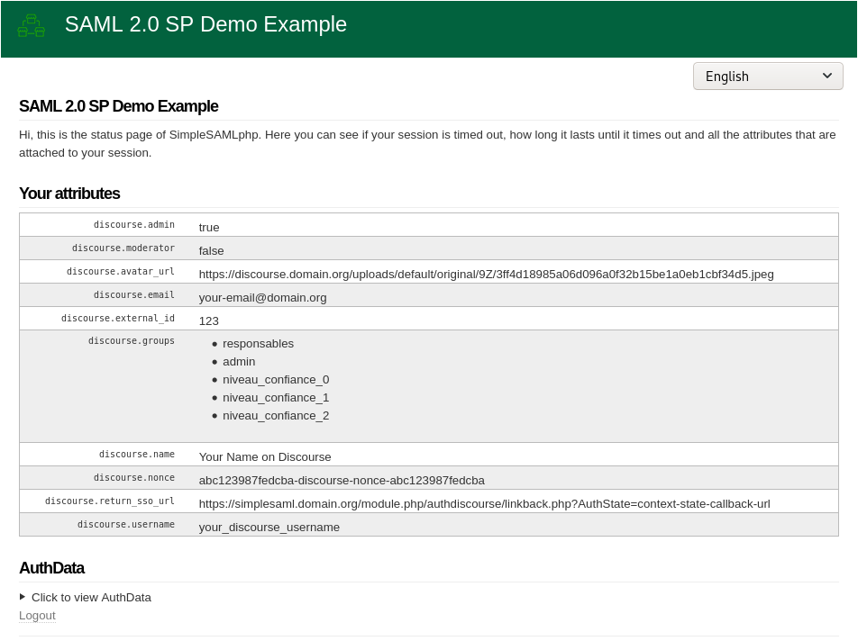

Using the Discourse authentication source with SimpleSAMLphp
==========================================================

Remember to configure your simplesamlphp `config/authsources.php` file with the following configuration items:

| key      | type     | Description                                                                             |
|----------|----------|-----------------------------------------------------------------------------------------|
| `secret` | `string` | The SSO secret defined in your Discourse configuration (`sso provider secrets` setting) |
| `url`    | `string` | The URL of your Discourse server                                                        |

Example `config/authsources.php` file:

```php
<?php

$config = [
    // This is a authentication source which handles admin authentication.
    'admin' => [
        'core:AdminPassword',
    ],

    // This is the authentication source using the Discourse authentication.
    'discourse-sso' => [
      'authdiscourse:Discourse',
      'url' => 'https://discourse.your-domain.org',
      'secret' => '<your-sso-secret>',
    ],
];
```

Also, under Discourse admin site settings (/admin/site_settings) enable setting `enable sso provider` and add the same secret string (the one defined in `config/authsources.php`) to `sso provider secrets` (used to hash SSO payloads).

## Testing authentication

On the SimpleSAMLphp frontpage, go to the *Authentication* tab, and use the link:

  * *Test configured authentication sources*

Then choose the *discourse* authentication source.

Expected behaviour would then be that you are sent to Discourse, and asked to login on Discourse.

You will then be authenticated in SimpleSAMLphp and see an attribute set similar to this:



